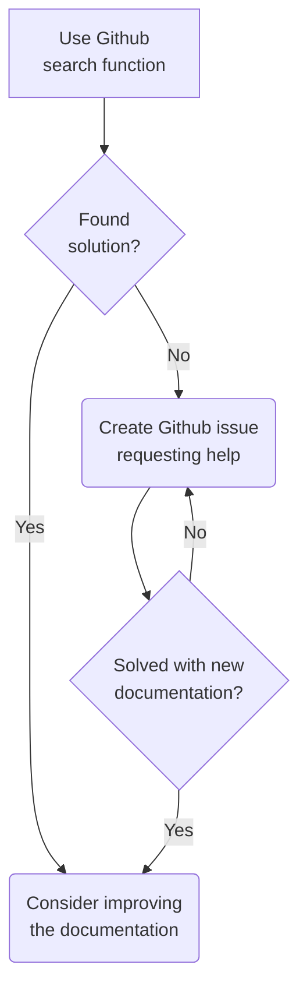
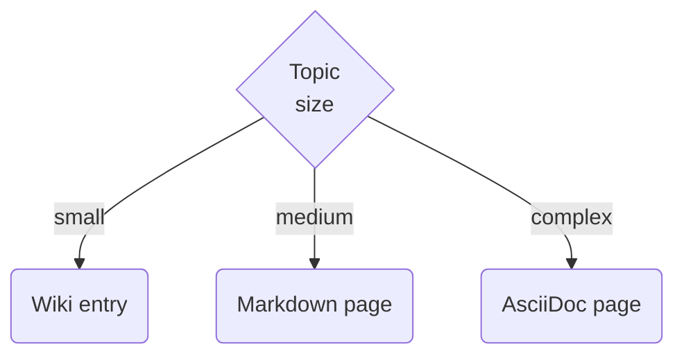

# Experimenting with github as a knowledge base

Includes:

* Longer documentation as regular files
* Smaller bits of information as a wiki
* Issues to track IT support operation tasks
* Projects to plan longer tasks
* Documentation changes can be reviewed by pull requests

Consider using webhooks to get changes of the github repo as a notification in Teams

## How to contribute

Everything here is text-based to make everything easily searachable. Therefore, all documents are either Markdown (.md, preferred, simple) or AsciiDoc (.adoc, for special cases, more powerful) to let you focus on content rather than formatting.

Additionally, all wiki entries are (under the hood) just Markdown files, so the same source code formatting applies.

| Markdown (.md)      | AsciiDoc (.adoc)                             |
|---------------------|----------------------------------------------|
| simple              | flexible/powerful                            |
| same syntax as wiki | create html/pdf in PyCharm or commandline    |
|                     | great tooling support in PyCharm             |

This has a couple of advantages:

* Everything is easily searchable
* Graphs can be included in text-based form (mermaid) making them searchable, version-controllable, and easily editable without special tools
* All changes are easily trackable and reversable with commits and pull requests. Old document versions can also be searched
* All text and even figure components can be referenced with permalinks in issues and other documents
* Since all IT support issues are also on github, they can directly and easily reference to all documents and their specific lines

## How to find information

## How to document information

