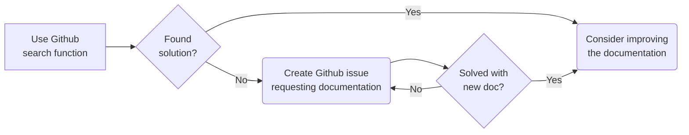
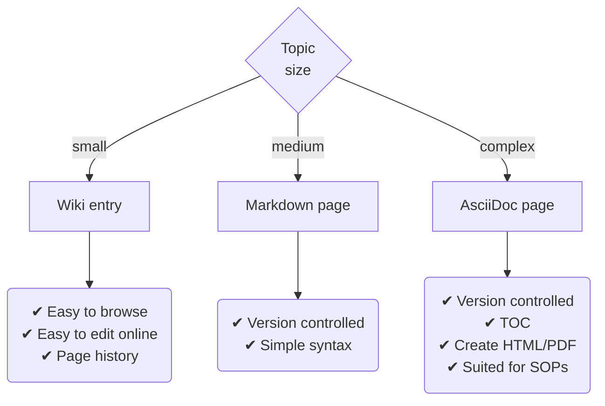

# Experimenting with github as a knowledge base

Includes:

* Longer documentation as regular files
* Smaller bits of information as a wiki
* Issues to track IT support operation tasks
* Projects to plan longer tasks
* Documentation changes can be reviewed by pull requests

Consider using webhooks to get changes of the Github repo as a notification in Teams.

## How to find information

## How to contribute

If you need to convert an existing markdown file to AsciiDoc (because you need more tooling), then consider using [kramdown-asciidoc](https://github.com/asciidoctor/kramdown-asciidoc).

All information is purely text based which means:
1. It is easily and quickly searchable
2. Everything is version controlled (with limitations for the wiki)
3. You can include text-based graphs (mermaid), meaning they are searchable
4. You can include figures by reference (automatic update)
5. You can focus on content, rather than formatting
6. You can reference specific lines of the documentation
7. The documentation is right where the issue/ticketing system and our code is located

Wiki entries and Markdown pages use the same Markdown syntax.

Here is some overview to help you chose what format you want to use for documentation

|                     | Wiki entry           | Markdown (.md) page | AsciiDoc (.adoc) page  |
|---------------------|----------------------|---------------------|------------------------|
| **topic scope**     | small                | medium              | complex                |
| **power**           | simple               | medium              | powerful               |
| **specialities**    | copy/paste pictures  | simple syntax       | create HTML/PDFs/Books |
| **github tooling**  | great                | none                | none                   |
| **PyCharm tooling** | n/a                  | ok                  | good                   |
| **version control** | only commit messages | version controlled  | version controlled     |

