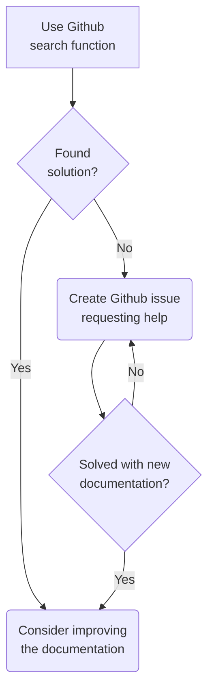

# This documents something

See [this link](https://github.blog/2022-02-14-include-diagrams-markdown-files-mermaid/) for more information how to create mermaid graphs directly in markdown.

## Example mermaid figure

See source code of this document for the syntax.

